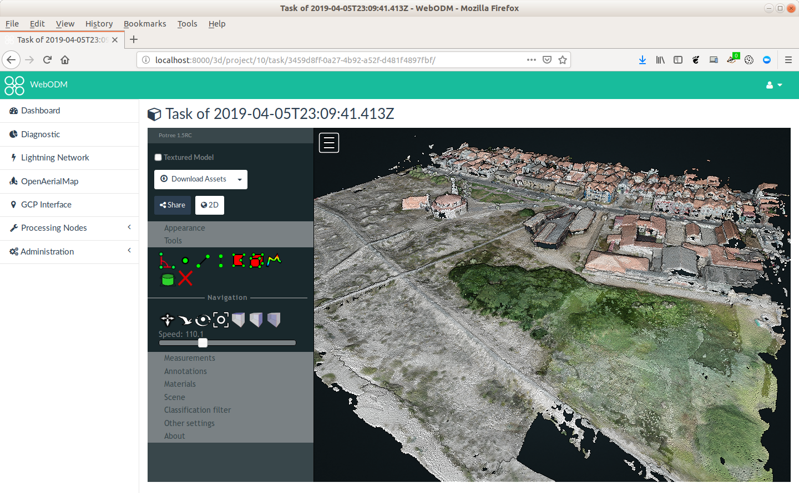
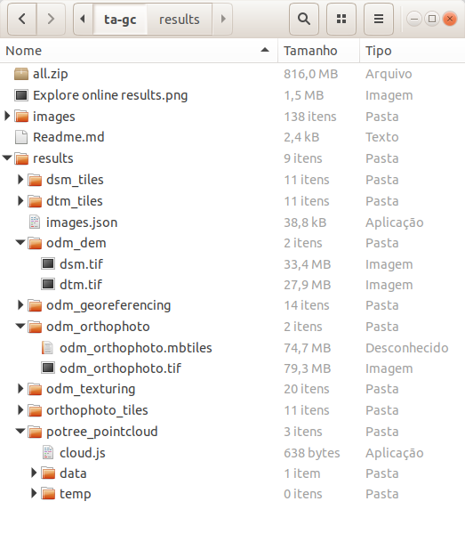

## Fork the repo

Use the GitHub interface to fork the repository https://github.com/jgrocha/ta-gc.git

## Clone the repo locally

Clone your repository to your local computer:

```
git clone https://github.com/yourname/ta-gc.git
```

You will get a new folder called `ta-gc`.

## Install WebODM

To install WebODM, we will need:

1. Docker
2. Python

### Install Docker (from the Official Docker Repository)

Howto: https://www.digitalocean.com/community/tutorials/como-instalar-e-usar-o-docker-no-ubuntu-18-04-pt

Add the Official Docker Repository

```
sudo apt install apt-transport-https ca-certificates curl software-properties-common
curl -fsSL https://download.docker.com/linux/ubuntu/gpg | sudo apt-key add -
sudo add-apt-repository "deb [arch=amd64] https://download.docker.com/linux/ubuntu bionic stable"
apt policy docker-ce
```

Install

```
sudo apt install docker-ce docker-compose
```

Run without sudo

```
sudo usermod -aG docker ${USER}
su - ${USER}
```

### Install Python (for Linux users)

```
sudo apt install python-setuptools
```

## Test docker installation

```
docker run hello-world
```

# Run WebODM

## Run WebODM using the command line script webodm.sh

[WebODM home page](https://github.com/OpenDroneMap/WebODM)

Use the shell (Linux/OSX) or the Power shell (windows) to run:

```
cd ta-gc
git clone https://github.com/OpenDroneMap/WebODM --config core.autocrlf=input --depth 1
cd WebODM
./webodm.sh update
```

It will take some time to download the WebODM image. Wait until the image if fully downloaded.

```
./webodm.sh start
```

After the service start, you can use WebODM from: http://localhost:8000

### New WebODM project

Open the WebODM interface: http://localhost:8000

### New task

Create a new task and add all the photos of this repository

### Explore the results within WebODM

Check if the results are fine (ortophoto, DSM, DTM and Point cloud)




### Publish you results in your own repo

Download all assets (all.zip) from WebODM interface to your local repo.

Unzip and add the assets to the repo, with:

```
mkdir results
unzip all.zip -d results
git add results
git commit -m "WebODM results"
git push origin
```

Your local folder should look like:



### Publish your results

Send an [email to the teacher](mailto:jgr@di.uminho.pt) with the link to your repo.
